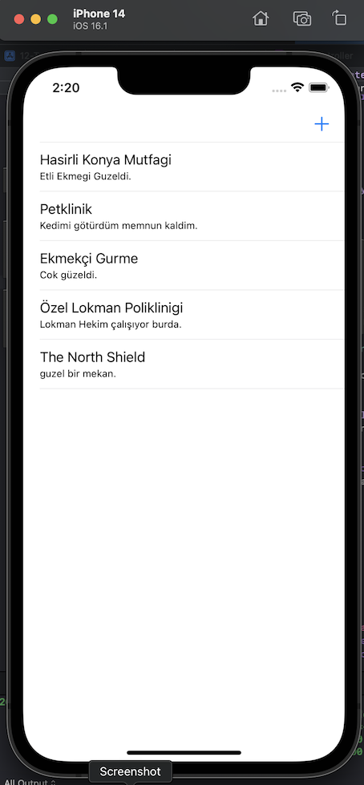
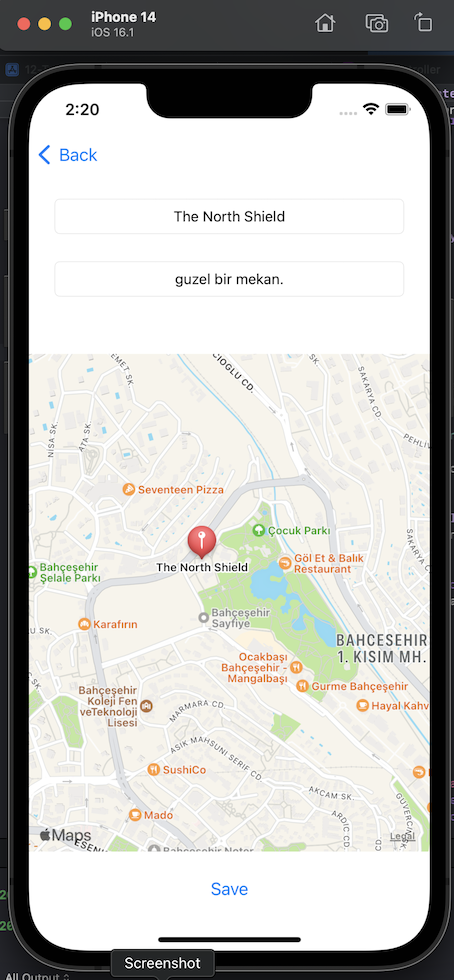

# TravelDiary

In this project, I used mapkit, coredata and tableView to create a map diary application, The user can pin by entering the name and short description of a place on the map, can go to pinned places via tableview and the user can click on the pin description to open it on the maps

<h1>Some of the features I learned:</h1>

-MapKit

-Create a map pin

-Open Maps from our application

